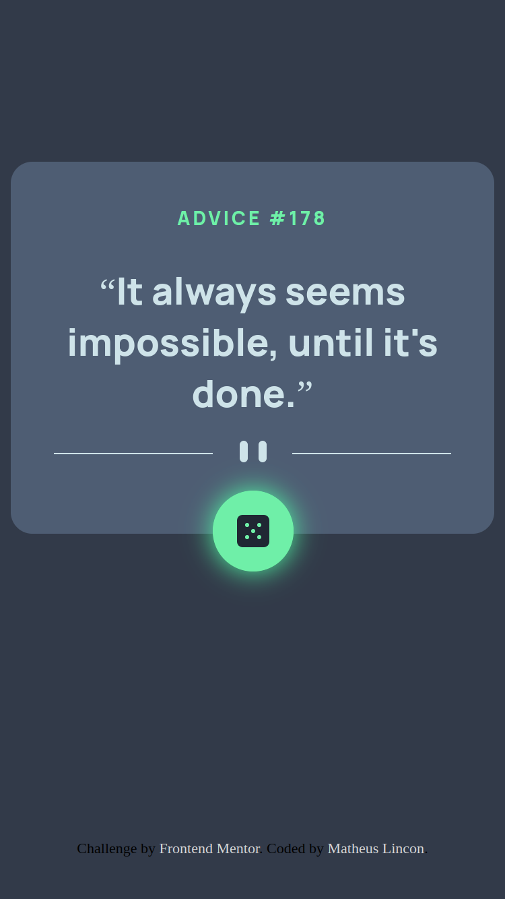

# Frontend Mentor - Advice generator app solution

This is a solution to the [Advice generator app challenge on Frontend Mentor](https://www.frontendmentor.io/challenges/advice-generator-app-QdUG-13db). Frontend Mentor challenges help you improve your coding skills by building realistic projects.

## Table of contents

- [Overview](#overview)
  - [The challenge](#the-challenge)
  - [Screenshot](#screenshot)
  - [Links](#links)
- [My process](#my-process)
  - [Built with](#built-with)
  - [What I learned](#what-i-learned)
  - [Useful resources](#useful-resources)
- [Author](#author)

## Overview

### The challenge

Users should be able to:

- Generate a random advice by pressing a dice button

---

### Screenshot




---

### Links

- Live Site URL: [Advice Generator App](https://your-live-site-url.com)

## My process

### Built with

- Semantic HTML5 markup
- JavaScript
- API Consuming
- Flexbox
- Position relative & absolute
- Mobile-first workflow

### What I learned

This advice app helped me to understand a little bit about how to consume API.

There are a lot of ways you can do it. In my case, to this project I used Axios CDN, you can see more here [Axios](https://axios-http.com/docs/intro).

Here some code:

```html
<body>
  <script src="https://cdn.jsdelivr.net/npm/axios/dist/axios.min.js"></script>
</body>
```

```js
const URL = 'https://api.adviceslip.com/'
function getAdvice() {
  axios
    .get(url)
    .then((response) => console.log(response)) // success!
    .catch((error) => console.log(error)) // error!
}
```

---

### Useful resources

- [Advice Slip JSON API](https://api.adviceslip.com/) - This API helped me to make the app. It's pretty simple to use, no complications.

---

## Author

- LinkedIn - [matheus.lincon.10010](https://www.linkedin.com/in/matheus-lincon-10010/)
- Frontend Mentor - [@matheus-lincon](https://www.frontendmentor.io/profile/matheus-lincon)

---
